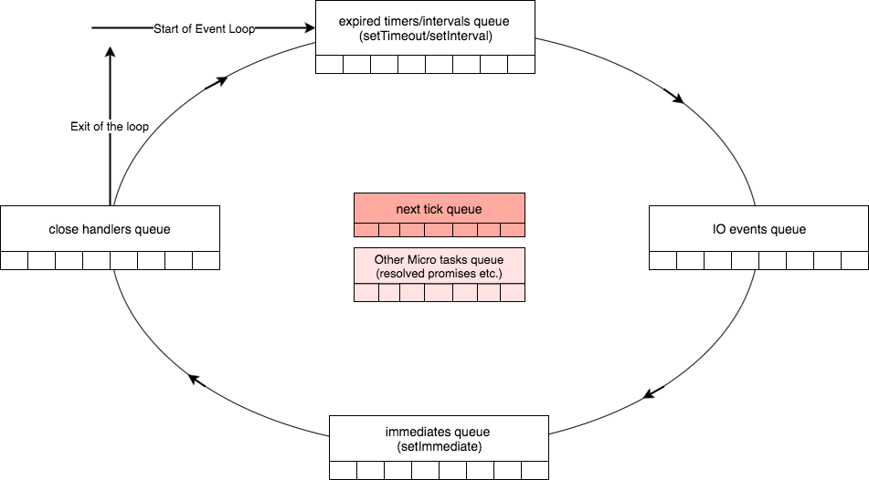

import { future } from "@mdx-deck/themes";
import { syntaxHighlighter } from "mdx-deck/themes";
export const themes = [future, syntaxHighlighter];
import { SplitRight } from "mdx-deck/layouts";
import { Steps, Appear } from "@mdx-deck/components";
import { Image, Notes } from "mdx-deck";

# Event Loop

_NodeJS Asynchronicity_

_Basics, Common Pitfalls & Solutions_

---

<SplitRight>

## What is the

## Event Loop?

</SplitRight>

---

<Steps
    length={2}
    render={({ step }) => (
        
    )}
/>

<Notes>
  
  - Event loop can be visualized like so

  - Next slide: better to show it like this

  - Next slide: or maybe like Life Cycle Events

  - Next slide: Event Loop is a flat circle

</Notes>

---

<Image src="./static/flatcircle.gif" />

---

<Split>

## Basics

<ul>
    <Appear>
        <li>NodeJS / V8 is single threaded</li>
        <li>Async = non-blocking</li>
        <li>Promises are async</li>
        <ul>
            <li>but are they non-blocking?</li>
        </ul>
    </Appear>
</ul>

</Split>

<Notes>
  
  - In all seriousness...

</Notes>

---

<Image src="./static/el3.png" size="80%" />

<Notes>
  
  - Using this visualization of the Event Loop

  - Go over each "Phase"

</Notes>

---

<Split>

## Phases - Timers
  
  - setTimeout() / setInterval() calls
    - Timer ms must have passed before evaluating
  - Evaluated once per loop in NodeJS
    - Brower handles this differently (but that's a different talk)
  - `setTimeout(, 0)` === `setTimeout(, 1)`
    - Always at least 1ms wait

</Split>

---

<Split>

## Phases - Poll

  - nextTick / micro tasks
    - "micro tasks" = Promise callbacks
  - Occurs between each Event Loop "Phase"
    - Node v11 and up handles this differently 😱
  - Phase ends when queue exhausted
  - Reolved Pomises in this phase are added back into this queue
    - Can result in "I/0 starvation", e.g. blocking the event loop

</Split>

---

<Split>

## Phases - I/O

  - e.g. handle incoming API requests, disk I/O, DNS lookups
  - Complex and varies based on host OS

</Split>

---

<Split>

## Phases - Immediates

  - setImmediate() calls
  - Callbacks added to setImmediate queue during this phase will be evaluated on next pass of the event loop

</Split>

---

<Split>

## Phases - Close Handlers

  - process.exit() and crashes of NodeJS process
  - Important for scripts, but generally not important in context of an API server
  - Last opportunity to cleanup before Node process is terminated
    - e.g. Draining database connections

</Split>

---

## Async Resolution Order

_DEMO: Promise.resolve / setTimeout / setImmediate_

<Notes>
    - Browser: nextTick callbacks and microtasks will run between each individual setTimeout and setImmediate callbacks
</Notes>

---

<Image src="./static/el3.png" size="80%" />

---

# Demo

## Blocking Event Loop

## with Promises

<Notes>
    demo blocking event loop on API server here and how to solve it

    Ping API server every second:
    while true; do date && curl -m 5 http://localhost:5000/api/auth && echo; sleep 1; done

    
    Blocking v Non-Blocking API requests:
    START=$(date +%s) && curl http://localhost:3000/loop && END=$(date +%s) && echo "Took: $(expr $END - $START) sec"
    START=$(date +%s) && curl http://localhost:3000/loop/bmap && END=$(date +%s) && echo "Took: $(expr $END - $START) sec"
    START=$(date +%s) && curl http://localhost:3000/loop/seti && END=$(date +%s) && echo "Took: $(expr $END - $START) sec"
    START=$(date +%s) && curl http://localhost:3000/loop/bird && END=$(date +%s) && echo "Took: $(expr $END - $START) sec"
    START=$(date +%s) && curl http://localhost:3000/loop/native && END=$(date +%s) && echo "Took: $(expr $END - $START) sec"
    START=$(date +%s) && curl http://localhost:3000/loop/sett && END=$(date +%s) && echo "Took: $(expr $END - $START) sec"
</Notes>

---

> _"The fair treatment of clients is thus the responsibility of your application."_ -NodeJS Docs

---

## Gather Reports

_Partitioning on the Event Loop Paradigm_

<Notes>
    show refactor of Admins Partners Report here
</Notes>

---

import { Split } from "mdx-deck/layouts";

<Split>

## Questions?

</Split>

---

## Helpful Articles

-   NodeJS Event Loop series - Deepal Jayasekara

    -   [Part 1 - Event Loop and the Big
        Picture](https://blog.insiderattack.net/event-loop-and-the-big-picture-nodejs-event-loop-part-1-1cb67a182810)
    -   [Part 3 - Promises, Next-Ticks, and
        Immediates](https://blog.insiderattack.net/promises-next-ticks-and-immediates-nodejs-event-loop-part-3-9226cbe7a6aa)

-   [Node.js: How even quick async functions can block the Event-Loop,
    starve I/O - Michael
    Gokhman](https://snyk.io/blog/nodejs-how-even-quick-async-functions-can-block-the-event-loop-starve-io/)

-   [[OFFICIAL] The Node.js Event Loop, Timers, and `process.nextTick()`](https://nodejs.org/en/docs/guides/event-loop-timers-and-nexttick)

-   [[OFFICIAL] Don't Block the Event Loop (or the Worker
    Pool)](https://nodejs.org/en/docs/guides/dont-block-the-event-loop/)

## Upcoming Talk

- Event Loop: NodeJS vs Browser
- How NodeJS v11 changes async resolution
